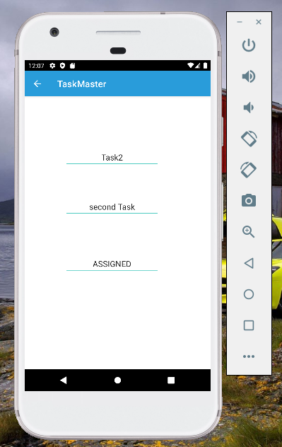
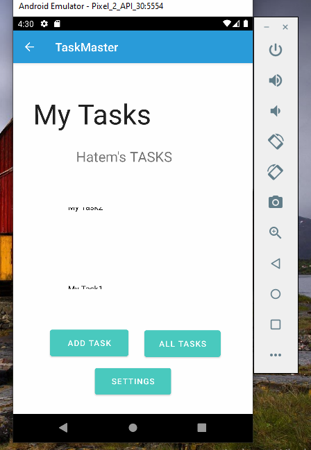

# taskmaster

## lab 26

## lab 27

## lab 28

## lab 29

## lab 31
- I added espresso tests to my app

## lab 32
I added the data to the dynamoDB and I viewed it in the mainActivity

## Lab: 33 - Related Data

- Creating a second entity for a team, which has a name and a list of tasks. Update your tasks to be owned by a team.

- Saving teams to dynamoDB

 
## Lab: 34 - Publishing to the Play Store
Building an APK for your taskMater App

[APK](app/release/output-metadata.json) 

